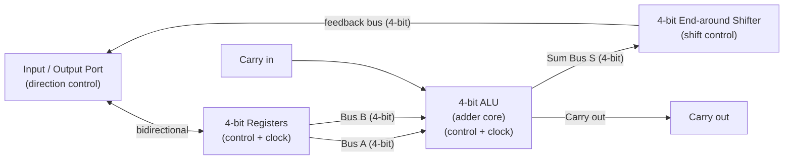
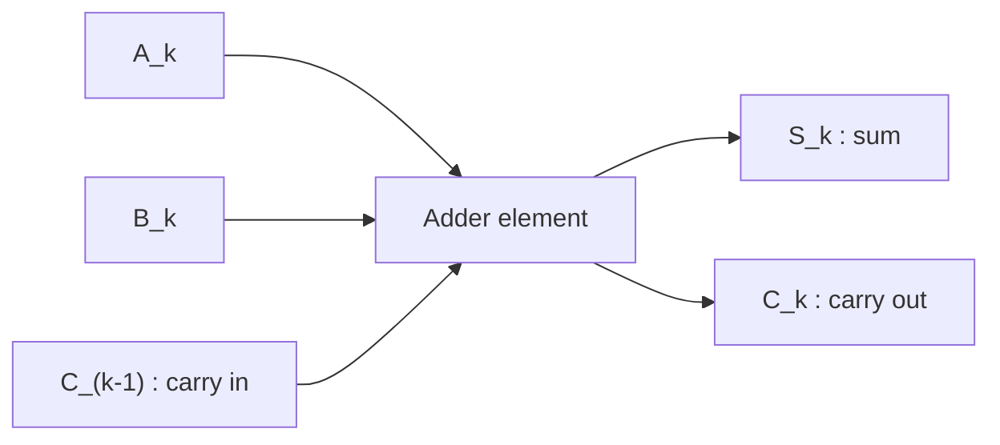
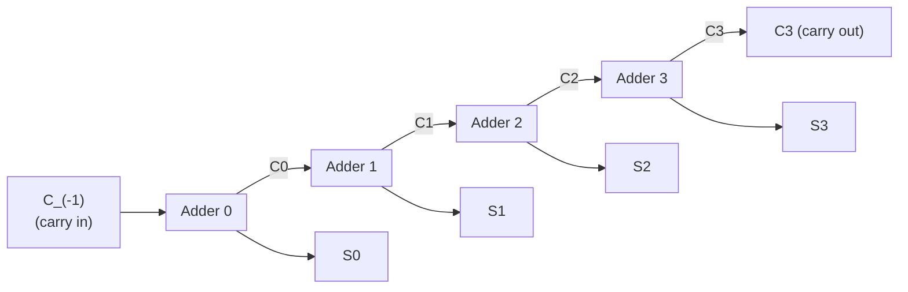
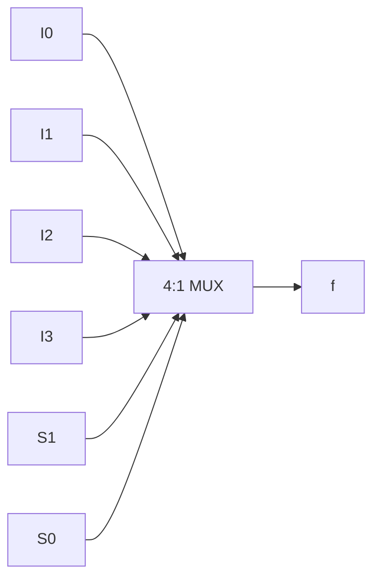
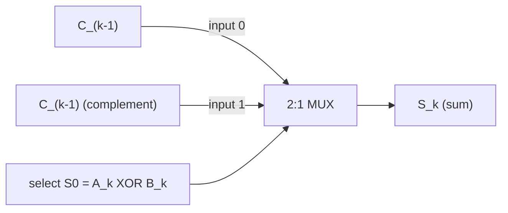
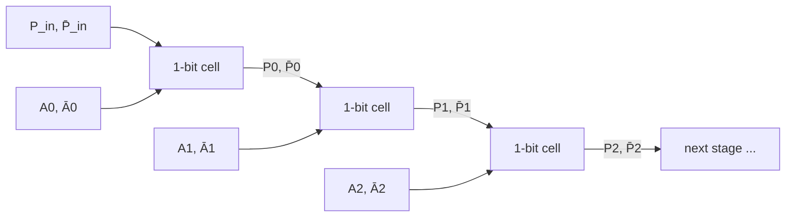

# Module-4 — Focused Exam Answers

> Source: answers are based primarily on `Module4_Part1.md` and `Module4_Part2.md`.
> Where information is not in the notes but is needed for correctness, it is marked **(beyond notes)**.
> Transistor schematics and stick diagrams cannot be drawn meaningfully in Markdown, so they are marked with an **[INSERT DIAGRAM: ...]** placeholder. Block/architecture/flow diagrams are drawn with Mermaid.

---

## Q1. Working principle of pseudo-nMOS logic (5 marks)

Pseudo-nMOS logic is obtained by taking a standard nMOS gate and replacing the depletion-mode pull-up transistor with a **p-transistor whose gate is permanently tied to V_SS (ground)**, so the p-device is always ON and acts as a static pull-up load.

- The **logic function is evaluated only by the n-block** (pull-down network of nMOS transistors). The p-transistor is just a resistive load.
- When the n-block is OFF, the always-on p-MOS pulls the output **HIGH**.
- When the n-block is ON, it must **override the weak p-MOS** and pull the output **LOW**. Hence it is **ratioed logic** — the relative strengths (sizes) of pull-up and pull-down must be chosen correctly.
- The inverter threshold is designed for `V_inv = 0.5·V_DD`. With `V_tn = |V_tp| = 0.2·V_DD`, `V_DD = 5 V`, and `μ_n = 2.5·μ_p`, the required ratio is:

$$\frac{Z_{p.u.}}{Z_{p.d.}}=\frac{3}{1}, \quad Z_{p.u.}=\frac{L_p}{W_p},\quad Z_{p.d.}=\frac{L_n}{W_n}$$

- At `V_inv = V_DD/2` the n-device is in saturation and the p-device is in its resistive region; equating their currents gives the inverter relation:

$$V_{inv}=V_{in}+\frac{(2\mu_p/\mu_n)^{1/2}\left[(-V_{DD}-V_{in})V_{dp}-V_{dip}^{2}\right]^{1/2}}{(Z_{p.u.}/Z_{p.d.})^{1/2}}$$

**[INSERT DIAGRAM: pseudo-nMOS inverter / 3-input NAND schematic — single p-MOS pull-up with gate tied to V_SS, nMOS n-block pull-down.]** *(Mermaid is not suitable for transistor schematics.)*

**Key reasoning (step-by-step):**
1. Start from a normal nMOS gate.
2. Swap the depletion load for a grounded-gate p-MOS (always ON).
3. n-block does the logic; p-MOS is only a load → ratioed logic.
4. Output HIGH when n-block off, LOW when n-block on (must win the ratio).
5. Size the devices so `Z_pu/Z_pd = 3/1` to set `V_inv = V_DD/2`.

---

## Q2. Working principle of Dynamic CMOS logic (5 marks)

Dynamic CMOS logic implements the function in the faster **n-block (nMOS)**, and uses a single clocked **p-transistor for precharging** the output node `Z`, plus a clocked **n-transistor "foot"** for evaluation. It works in two clock phases:

- **Precharge phase (φ = 0):** the precharge p-MOS turns ON and charges the output capacitance at node `Z` to `V_DD`. The bottom (foot) n-MOS is OFF, so there is **no static current path** and no static power dissipation.
- **Evaluate phase (φ = 1):** the p-MOS turns OFF and the foot n-MOS turns ON. The inputs applied to the n-block are now evaluated — if the n-block conducts (e.g. A=B=C=1 for a NAND), `Z` discharges to `V_SS`; otherwise `Z` stays high.

Important limitations from the notes:
1. **Charge sharing** can be a problem unless the inputs are constrained **not to change during the ON (evaluate) period** of the clock.
2. **Single-phase dynamic gates cannot be cascaded** — due to circuit delays, an incorrect input may reach the next stage when evaluation begins, wrongly discharging its output. One remedy is a **four-phase clock** using derived clocks φ12, φ23, φ34, φ41.

**[INSERT DIAGRAM: dynamic CMOS 3-input NAND schematic — clocked precharge p-MOS on top, series n-block (A,B,C), clocked evaluate n-MOS foot to V_SS; plus 4-phase clock timing diagram.]**

**Key reasoning (step-by-step):**
1. Logic sits in the fast n-block.
2. φ=0 → precharge Z to V_DD via p-MOS (no static power).
3. φ=1 → evaluate: foot n-MOS on; n-block either discharges Z or not.
4. Output validity depends on inputs being stable during evaluate.
5. Single-phase can't cascade → use 4-phase derived clocks.

---

## Q3. Clocked CMOS (C²MOS) logic (5 marks)

In Clocked CMOS (C²MOS) logic the function is implemented in **both n- and p-transistors** — a pull-up **p-block** and a complementary pull-down **n-block**, exactly as in ordinary static CMOS. The difference is that the logic is **connected to the output (evaluated) only during the ON period of the clock**, by adding clocked transistors in series with the output:

- A **clocked p-MOS driven by φ̄** is placed in series with the p-block.
- A **clocked n-MOS driven by φ** is placed in series with the n-block.
- When the clock is inactive (φ = 0, φ̄ = 1) the output `Z` is **isolated (high impedance)**.
- When the clock is active (φ = 1, φ̄ = 0) the p-block/n-block drive `Z` normally.

A **clocked inverter** is the simplest member of this family. Because of the **extra series transistors**, slower rise-times and fall-times are expected.

**[INSERT DIAGRAM: C²MOS schematic — (a) 2-input clocked NOR gate, (b) clocked inverter; clocked p-MOS (φ̄) in series with p-block, clocked n-MOS (φ) in series with n-block.]**

**Key reasoning (step-by-step):**
1. Use full complementary CMOS (p-block + n-block).
2. Insert a clocked p-MOS (φ̄) and clocked n-MOS (φ) in series with the output.
3. Clock off → output high-impedance (isolated).
4. Clock on → logic drives the output.
5. Extra series devices → slower edges.

---

## Q4. Working principle of CMOS Domino logic (5 marks)

Domino logic is a modified dynamic CMOS gate with a **static CMOS inverter (buffer) added at the output** of the dynamic node. This lets dynamic gates be **cascaded using only a single-phase clock**.

- **Precharge (φ = 0):** the dynamic node is precharged to `V_DD` through the precharge p-MOS, so the buffered output `Z` is driven **LOW (0)**.
- **Evaluate (φ = 1):** the foot n-MOS turns on. If the n-block conducts, the dynamic node discharges and the inverter drives `Z` **HIGH (1)**.
- Because the output buffer only allows a **single 0→1 transition** during evaluation, gates can be chained (one switching like falling dominoes) without race problems.

Key remarks from the notes:
1. Can have **smaller area** than conventional CMOS logic.
2. **Smaller parasitic capacitance → higher speed**.
3. **Glitch-free** — each gate makes only one 1→0 transition (at the dynamic node).
4. **Only non-inverting structures** are possible (due to the inverting output buffer).
5. **Charge distribution / charge sharing** may be a problem and must be considered.

**[INSERT DIAGRAM: CMOS domino gate schematic — clocked precharge p-MOS, n-block, clocked foot n-MOS, followed by a static CMOS inverter to output Z.]**

**Key reasoning (step-by-step):**
1. Take a dynamic gate, add a static inverter at its output.
2. Precharge → dynamic node high → buffered output low.
3. Evaluate → if n-block conducts, node falls, output rises (0→1 only).
4. Single 0→1 transitions allow single-phase cascading.
5. Trade-off: only non-inverting gates; watch charge sharing.

---

## Q5. Short notes on switch logic (5 marks)

Switch logic is based on the **pass transistor** or on **transmission gates**. It is fast for small arrays, takes **no static current** from the rails (current flows only on switching → low power), and the path through each switch is **isolated from the controlling signal** (like relay-contact logic), giving the designer freedom.

**(i) Pass transistors**
- A simple **single n- (or p-) MOS transistor** used as a switch: data on source/drain, control on the gate.
- Series pass transistors realise an AND of the gate controls, e.g. for a 4-way series switch `V_out = V_in when A·B·C·D = 1`.
- **Drawback — threshold-voltage degradation:** an n-switch passing a logic 1 only rises to `V_DD − V_tn` (e.g. +4 V instead of +5 V → degraded "1"); a p-switch passing a logic 0 only falls to `|V_tp|` (e.g. +1 V → degraded "0"). Long series chains also add RC delay.

**(ii) Transmission gates**
- A **complementary switch**: an n-pass and a p-pass transistor in **parallel**, driven by complementary controls `X` and `X̄`.
- Passes **full logic levels with no V_t degradation** (n-MOS passes a strong 0, p-MOS passes a strong 1), and has **lower ON resistance** than a single pass transistor.
- Costs: occupies **more area** and needs **complementary drive signals**.

**[INSERT DIAGRAM: (a) n-pass transistor passing a degraded 1; (b) p-pass passing a degraded 0; (c) transmission gate schematic (n+p in parallel) with its bow-tie symbol.]**

**Key reasoning (step-by-step):**
1. Switch logic = isolated switches, no static power.
2. Pass transistor = one MOS device; series = AND of controls.
3. Single device degrades the passed level by V_t.
4. Transmission gate = n+p in parallel → full-swing, lower R_on.
5. TG costs more area and needs X and X̄.

---

## Q6. 4-bit data path for a processor with block diagram (5 marks)

The data path is the "heart" of the processor and is built around the **4-bit ALU (adder)**. Data circulates through registers → ALU → shifter → back to registers.

- Two **4-bit buses (A, B)** carry the operands from the registers to the ALU.
- The ALU produces a **4-bit sum S** (stored at the adder output) plus a **carry out**, and accepts a **carry in**.
- The **end-around shifter** is an unclocked switch array (no storage); it takes the 4-bit sum and feeds the shifted result back to the I/O port / register array via a feedback bus.
- **Timing:** clock phase φ1 is when signals are fed along the buses to the adder input and the sum is stored at the adder output. The ALU is clocked; the shifter is **unclocked** but driven by four shift-control lines.

**Key reasoning (step-by-step):**
1. Registers hold operands; send them on buses A and B.
2. ALU (adder) computes S with carry-in/carry-out during φ1.
3. Sum is stored at the adder output.
4. Shifter (switch array, no storage) shifts S, driven by shift-control lines.
5. Result feeds back through the I/O port to the registers.

---

## Q7. Standard adder element (5 marks)

A standard adder element is a **full-adder cell** (one bit-slice) with three inputs and two outputs.

- **Inputs:** operand bits `A_k`, `B_k`, and previous carry `C_(k-1)`.
- **Outputs:** sum `S_k` and new carry `C_k`.
- **Logic implemented:**

$$S_k = A_k \oplus B_k \oplus C_{k-1}$$
$$C_k = A_k\cdot B_k + C_{k-1}\cdot(A_k \oplus B_k)$$

- Using `H_k = A_k ⊕ B_k`, the notes write these compactly as `S_k = H_k·C̄_(k-1) + H̄_k·C_(k-1)` and `C_k = H_k·C_(k-1) + A_k·B_k`.
- It is designed as a **standard/regular cell** so an n-bit adder is formed simply by replication (cascading).

**Key reasoning (step-by-step):**
1. One bit-slice takes A_k, B_k, C_(k-1).
2. Sum = XOR of the three inputs.
3. Carry-out = majority: A_k·B_k OR carry propagated by H_k.
4. Define H_k = A_k ⊕ B_k to simplify.
5. Make it a regular cell for cascading into n bits.

---

## Q8. n-p CMOS logic (5 marks)

n-p CMOS logic (also called **NORA — "No Race" logic**) is a variation of dynamic logic in which the cascaded logic blocks are **alternately n-block and p-block** stages, so that dynamic gates can be cascaded **without intervening static inverters**.

- **Clocking:** the precharge and evaluate transistors are fed from `φ` and `φ̄` **alternately**. The roles of the top and bottom transistors also alternate between precharge and evaluate from stage to stage.
- A signal that has been evaluated in an **n-block stage** feeds directly into a **p-block stage**, then back into an n-block stage, and so on.
- The strict alternation of clock phases **prevents evaluation overlap (races)** between adjacent stages — hence "no race".

**[INSERT DIAGRAM: n-p CMOS (NORA) pipeline — Stage 1 precharge p-MOS + n-block, Stage 2 p-block + precharge n-MOS, Stage 3 precharge p-MOS + n-block; clocks φ and φ̄ alternating.]**

**Key reasoning (step-by-step):**
1. Dynamic logic, but blocks alternate n / p / n / p.
2. Clock and clock-bar drive precharge/evaluate alternately.
3. n-block output drives next p-block directly (no static buffer).
4. Alternating phases stop adjacent stages overlapping.
5. Result: race-free cascading (NORA).

---

## Q9. Design a 4-bit adder by cascading four adder elements (7 marks)

A 4-bit adder is built by **cascading four standard adder elements** (full-adder cells) in a **ripple-carry** arrangement: each cell's carry-out feeds the next cell's carry-in.

- **Inputs:** operand pairs (A0,B0), (A1,B1), (A2,B2), (A3,B3) and initial carry `C_(-1)`.
- **Outputs:** sum bits S0–S3 and final carry `C3`.
- Each cell computes `S_k = A_k ⊕ B_k ⊕ C_(k-1)` and `C_k = A_k·B_k + C_(k-1)·(A_k ⊕ B_k)`.
- **Carry propagation:** carry ripples from stage k to stage k+1; the first stage gets `C_(-1)` and the last produces `C3`.
- Two vertical bus lines for **V_DD and GND** run through all four cells, reflecting the regular replicated layout.

**Key reasoning (step-by-step):**
1. Use four identical full-adder cells, one per bit.
2. Wire each carry-out to the next carry-in (ripple).
3. Feed C_(-1) into stage 0.
4. Each cell outputs its S_k; final stage outputs C3.
5. Regular structure → power rails run straight through all cells.

---

## Q10. Design of the 4-bit adder with Sum & Carry equations (7 marks)

Starting from the full-adder truth table for bit `k` (inputs `A_k`, `B_k`, previous carry `C_(k-1)`; outputs sum `S_k`, new carry `C_k`):

| A_k | B_k | C_(k-1) | S_k | C_k |
|---|---|---|---|---|
| 0 | 0 | 0 | 0 | 0 |
| 0 | 0 | 1 | 1 | 0 |
| 0 | 1 | 0 | 1 | 0 |
| 0 | 1 | 1 | 0 | 1 |
| 1 | 0 | 0 | 1 | 0 |
| 1 | 0 | 1 | 0 | 1 |
| 1 | 1 | 0 | 0 | 1 |
| 1 | 1 | 1 | 1 | 1 |

**Sum derivation:**

$$S_k=\overline{A_k}\,\overline{B_k}\,C_{k-1}+\overline{A_k}B_k\overline{C_{k-1}}+A_k\overline{B_k}\,\overline{C_{k-1}}+A_kB_kC_{k-1}$$
$$S_k=(\overline{A_k}B_k+A_k\overline{B_k})\overline{C_{k-1}}+(\overline{A_k}\,\overline{B_k}+A_kB_k)C_{k-1}$$
$$S_k=(A_k\oplus B_k)\overline{C_{k-1}}+(\overline{A_k\oplus B_k})C_{k-1}=H_k\overline{C_{k-1}}+\overline{H_k}C_{k-1}$$

**Carry derivation:**

$$C_k=\overline{A_k}B_kC_{k-1}+A_k\overline{B_k}C_{k-1}+A_kB_k\overline{C_{k-1}}+A_kB_kC_{k-1}$$
$$C_k=(\overline{A_k}B_k+A_k\overline{B_k})C_{k-1}+(C_{k-1}+\overline{C_{k-1}})A_kB_k$$
$$C_k=(A_k\oplus B_k)C_{k-1}+A_kB_k=H_kC_{k-1}+A_kB_k$$

$$\text{where } H_k=A_k\oplus B_k=\overline{A_k}B_k+A_k\overline{B_k},\qquad 0\le k\le n-1$$

**Useful observations (from notes):**
- If `A_k = B_k` then `S_k = C_(k-1)`; if `A_k ≠ B_k` then `S_k = C̄_(k-1)`.
- If `A_k = B_k` then `C_k = A_k = B_k` (i.e. C_k = 1 when both are 1, C_k = 0 when both are 0); if `A_k ≠ B_k` then `C_k = C_(k-1)`.

The full 4-bit adder is realised by cascading four such bit-slices (see Q9).

**Key reasoning (step-by-step):**
1. Write the full-adder truth table.
2. Sum-of-products for S_k, then factor out C_(k-1) / C̄_(k-1).
3. Recognise A_k⊕B_k = H_k → S_k = H_k·C̄_(k-1)+H̄_k·C_(k-1).
4. Repeat for C_k → C_k = H_k·C_(k-1)+A_k·B_k.
5. Cascade four bit-slices for the 4-bit adder.

---

## Q11. 4-bit shifter using a crossbar switch + disadvantage (8 marks)

**Requirement of the shifter:** shift incoming data by up to (n−1) places left or right on an **end-around** basis; it needs a 4-line parallel data input, four shifted output lines, and a means of producing any shift from 0 to 3 bits.

**Crossbar (4×4) design:** Use a **4×4 matrix of 16 nMOS pass transistors** `SW00 … SW33`. Four **vertical input lines** `in0–in3` feed the transistor sources column-wise; four **horizontal output lines** `out0–out3` take the drains row-wise. **Every intersection** of an input line and an output line has a pass transistor, so by turning on the appropriate `SW_ij` **any input can be connected to any output**.

Example routing (a shift): in0→out3, in1→out0, in2→out1, in3→out2 (via SW03, SW10, SW21, SW32).

Connection grid (which switch links each input to each output):

|        | out3 | out2 | out1 | out0 |
|--------|------|------|------|------|
| **row→in3** | SW33 | SW32 | SW31 | SW30 |
| **row→in2** | SW23 | SW22 | SW21 | SW20 |
| **row→in1** | SW13 | SW12 | SW11 | SW10 |
| **row→in0** | SW03 | SW02 | SW01 | SW00 |

**[INSERT DIAGRAM: 4×4 crossbar switch — 16 nMOS pass transistors at the grid intersections of vertical inputs in0–in3 and horizontal outputs out0–out3.]**

**Disadvantage:**
- It needs **too many independent control signals** — one gate control per switch (**16 control lines** for a 4×4), so complexity is undesirable and it does not scale.
- If **all switches are activated**, all outputs are **short-circuited to all inputs**.

**Key reasoning (step-by-step):**
1. Shifter spec: 4 in, 4 out, shifts 0–3, end-around.
2. Place a pass transistor at every in/out crossing (16 total).
3. Turn on selected SW_ij to route any input to any output.
4. This gives full generality (any-to-any).
5. But it needs 16 control lines (complex) and risks shorting if all are on.

---

## Q12. 4-bit barrel shifter + advantage over the 4×4 crossbar (8 marks)

A barrel shifter is a 4×4 array of **16 nMOS pass transistors**, but instead of 16 independent controls, the gates are **wired diagonally (staircase fashion)** and driven by just **4 shift-control lines** `sh0, sh1, sh2, sh3`, which must be **mutually exclusive** when active.

- Activating `sh0`: in0→out0, in1→out1, in2→out2, in3→out3 (shift by 0).
- Activating `sh1`: in0→out1, in1→out2, in2→out3, in3→out0 (shift/rotate by 1).
- …and so on for sh2, sh3 (the inputs wrap around — "barrel" / end-around rotation).

**[INSERT DIAGRAM: 4×4 barrel shifter — 16 nMOS transistors with gates tied diagonally to the four shift lines sh0–sh3; inputs in0–in3 vertical, outputs out0–out3 horizontal.]**

**Advantages over the 4×4 crossbar switch:**
- Needs only **4 shift-control signals** (mutually exclusive) instead of 16 → far less control complexity.
- **High regularity and generality** of structure.
- **Faster:** there is only **one n-type switch between an input and its corresponding output line** (the crossbar may pass through more devices), so the output is produced at a faster rate.
- Although logic-1 levels at the output are **degraded**, they are passed through **restoring logic** afterwards.

**Key reasoning (step-by-step):**
1. Same 16-transistor grid as the crossbar.
2. Tie gates diagonally → control by 4 lines sh0–sh3.
3. Each shift line selects one rotation amount (end-around).
4. Only one switch lies between any input and its output → fast.
5. 4 controls vs 16 → regular, simple, scalable (degraded 1s restored later).

---

## Q13. 4:1 MUX using nMOS logic — schematic + stick diagram (8 marks)

A 4:1 multiplexer routes one of four data inputs `I0–I3` to output `f` using two select lines `S1, S0`.

**Boolean function:**

$$f=\overline{S_1}\,\overline{S_0}\,I_0+\overline{S_1}S_0I_1+S_1\overline{S_0}I_2+S_1S_0I_3$$

**nMOS pass-transistor implementation:** Use **8 nMOS pass transistors in a 4×2 matrix** — each data input passes through **two series pass transistors** gated by the appropriate select/complement lines, and all four rows tie to a common output `f`:
- Row I0: gated by `S̄1` and `S̄0`
- Row I1: gated by `S̄1` and `S0`
- Row I2: gated by `S1` and `S̄0`
- Row I3: gated by `S1` and `S0`

Because simple nMOS pass transistors are used, the **logic-1 levels at `f` are degraded by V_t**.

**[INSERT DIAGRAM (schematic): 4:1 MUX nMOS — 8 pass transistors in a 4×2 array, data I0–I3 on horizontal lines, select lines S1, S̄1, S0, S̄0 vertical (poly) gates, outputs tied to common node f.]**

**[INSERT DIAGRAM (stick): 4:1 MUX nMOS — vertical red poly lines (S1, S̄1, S0, S̄0), horizontal green n-diffusion lines for I0–I3, contacts where poly crosses diffusion to form the pass transistors, metal node collecting the four rows into f.]**

**Key reasoning (step-by-step):**
1. MUX selects 1 of 4 inputs from the 2 select bits.
2. Write f as the sum of four AND terms (one per select code).
3. Realise each term with two series nMOS pass transistors.
4. Tie all four rows to a common output f.
5. nMOS pass transistors degrade the logic-1 (V_t loss).

---

## Q14. Implement ALU functions (EX-OR, EX-NOR, OR) with an adder (8 marks)

By forcing the carry line `C_(k-1)` to a fixed value (0 or 1) instead of letting it ripple, the adder cell becomes a **logic unit**. Using the adder equations:

$$S_k=H_k\overline{C_{k-1}}+\overline{H_k}C_{k-1},\qquad C_k=H_kC_{k-1}+A_kB_k,\qquad H_k=A_k\oplus B_k$$

**EX-OR (on the sum output, C_(k-1) = 0):**
$$S_k=H_k=\overline{A_k}B_k+A_k\overline{B_k}=A_k\oplus B_k \;=\; \textbf{EX-OR}$$

**EX-NOR (on the sum output, C_(k-1) = 1):**
$$S_k=\overline{H_k}=\overline{A_k}\,\overline{B_k}+A_kB_k \;=\; \textbf{EX-NOR}$$

**OR (on the carry output, C_(k-1) = 1):**
$$C_k=H_k+A_kB_k=(\overline{A_k}B_k+A_k\overline{B_k})+A_kB_k=\overline{A_k}B_k+A_k=A_k+B_k \;=\; \textbf{OR}$$

*(Note from notes: the carry output with `C_(k-1) = 0` gives `C_k = A_k·B_k = AND`, completing the set AND/OR/EX-OR/EX-NOR.)*

**[INSERT DIAGRAM: 4-bit ALU — four cascaded adder bit-slices with the carry-in line C_(-1) used as the operation-mode select (0 or 1).]**

**Key reasoning (step-by-step):**
1. Take the standard adder Sum and Carry equations.
2. Treat the carry line as a control input (fix it at 0 or 1).
3. Sum with C_(k-1)=0 → S_k = H_k = EX-OR.
4. Sum with C_(k-1)=1 → S_k = H̄_k = EX-NOR.
5. Carry with C_(k-1)=1 → C_k = A_k + B_k = OR (and C_(k-1)=0 → AND).

---

## Q15. Multiplexer-based adder logic with stored and buffered sum output (8 marks)

The adder element can be built from a **multiplexer** by exploiting the identity: when `A_k = B_k`, `S_k = C_(k-1)`; when `A_k ≠ B_k`, `S_k = C̄_(k-1)`. So a **2:1 MUX** selecting between `C_(k-1)` and `C̄_(k-1)` produces the sum, with the **select line `S0 = A_k ⊕ B_k`**.

- `S0 = 0` (i.e. `A_k = B_k`) → output `S_k = C_(k-1)`, and the carry `C_k = A_k = B_k`.
- `S0 = 1` (i.e. `A_k ≠ B_k`) → output `S_k = C̄_(k-1)`, and the carry `C_k = C_(k-1)`.

**Stored and buffered sum output:** the multiplexing is physically built with a **pass-transistor / transmission-gate network**: horizontal lines `A_k, Ā_k, B_k, B̄_k` gate the routing of `C_(k-1)` (or `C̄_(k-1)`) to the sum line. The selected carry is passed to produce `S̄_k`, which is then **inverted/buffered to `S_k`** (the buffer both restores the level and **stores/holds** the sum at the adder output so it can be fed to the shifter). The same network also generates the new carry `C_k`.

**[INSERT DIAGRAM: pass-transistor / transmission-gate adder network — A_k, Ā_k, B_k, B̄_k as gating lines routing C_(k-1)/C̄_(k-1) to S̄_k, with an output inverter/buffer producing the stored, buffered S_k, plus the C_k output.]**

**Key reasoning (step-by-step):**
1. Use the rule: S_k = C_(k-1) if A_k=B_k, else C̄_(k-1).
2. So a 2:1 MUX picks between C_(k-1) and its complement.
3. Select line is S0 = A_k ⊕ B_k.
4. Build the MUX with pass transistors/transmission gates.
5. Invert/buffer the result → restored, stored S_k output (plus C_k).

---

## Q16. 4:1 MUX using nMOS logic — schematic + stick diagram (8 marks)

*(Same design as Q13.)*

A 4:1 MUX selects one of `I0–I3` onto `f` using `S1, S0`:

$$f=\overline{S_1}\,\overline{S_0}\,I_0+\overline{S_1}S_0I_1+S_1\overline{S_0}I_2+S_1S_0I_3$$

Selection truth table:

| S1 | S0 | f |
|----|----|----|
| 0 | 0 | I0 |
| 0 | 1 | I1 |
| 1 | 0 | I2 |
| 1 | 1 | I3 |

**nMOS implementation:** 8 nMOS pass transistors in a 4×2 matrix; each input passes through two series transistors gated by the select/complement pair for its row (I0:S̄1,S̄0 / I1:S̄1,S0 / I2:S1,S̄0 / I3:S1,S0), with all rows tied to common output `f`. nMOS pass transistors **degrade the passed logic-1** by V_t.

**[INSERT DIAGRAM (schematic): 4:1 MUX nMOS — 8 pass transistors (4×2), data inputs I0–I3 horizontal, selects S1, S̄1, S0, S̄0 as vertical poly gates, common output node f.]**

**[INSERT DIAGRAM (stick): 4:1 MUX nMOS — vertical red poly (S1, S̄1, S0, S̄0), horizontal green n-diffusion for I0–I3, contacts at poly/diffusion crossings, metal output node f.]**

**Key reasoning (step-by-step):**
1. Two select bits choose one of four inputs.
2. f = sum of four product terms (one per select code).
3. Each term = two series nMOS pass transistors.
4. All rows share the output node f.
5. nMOS pass devices cause V_t degradation of logic-1.

---

## Q17. Parity generator using CMOS logic + stick diagram (8 marks)

**Function:** a parity generator indicates the parity of an (n+1)-bit word — output `P = 1` for an **even** number of 1s, `P = 0` for an **odd** number of 1s. It is built from a basic **1-bit cell** cascaded n times. Each cell updates the running parity with the current bit `A_i`:

- If `A_i = 1`, parity changes: `P_i = P̄_(i-1)`.
- If `A_i = 0`, parity unchanged: `P_i = P_(i-1)`.

$$P_i=\overline{P_{i-1}}A_i+P_{i-1}\overline{A_i}\quad(\text{an XOR/XNOR stage})$$

**CMOS implementation of the 1-bit cell:** a complementary gate plus an output inverter.
- **Pull-down n-block:** two parallel branches — branch 1: `A_i` in series with `P̄_(i-1)`; branch 2: `Ā_i` in series with `P_(i-1)` (four nMOS total).
- **Pull-up p-block:** the dual (complement) pMOS network that pulls the intermediate node `P̄_i` to V_DD when the n-block is off.
- The complex-gate output `P̄_i` is passed through a **static CMOS inverter** to give the true buffered output `P_i`.

**[INSERT DIAGRAM (CMOS schematic): parity 1-bit cell — pull-up p-block (dual network) + pull-down n-block (two series branches A_i·P̄_(i-1) and Ā_i·P_(i-1)) producing P̄_i, followed by a static inverter for P_i.]**

**[INSERT DIAGRAM (stick): CMOS parity 1-bit cell — V_DD rail (top) and GND rail (bottom), vertical red poly inputs A_i, P̄_(i-1), P_(i-1), Ā_i crossing p-diffusion (top) and n-diffusion (bottom), dashed demarcation line separating p- and n-devices, metal routing the gate output to a CMOS inverter for P_i.]**

**Key reasoning (step-by-step):**
1. Parity = XOR of all bits → cascade of 1-bit XOR cells.
2. Each cell: P_i = P̄_(i-1)·A_i + P_(i-1)·Ā_i.
3. n-block = two series branches in parallel for that function.
4. p-block = complementary dual; output node is P̄_i.
5. Add a static inverter to buffer P̄_i into P_i.

---

## Q18. Structured parity generator — basic block diagram + nMOS implementation (8 marks)

**Structured (basic) block view:** the requirement is, for an (n+1)-bit input word `A0…An`, to output `P` (and `P̄`) with `P = 1` for an even count of 1s and `P = 0` for an odd count. Rather than one monolithic block, the design is **partitioned into identical 1-bit cells cascaded in a daisy chain**, the parity propagating left-to-right:

Each cell takes the previous parity `P_(i-1)` and current bit `A_i` and outputs the updated parity:

$$P_i=\overline{P_{i-1}}A_i+P_{i-1}\overline{A_i}$$

**nMOS (depletion-load) implementation of the 1-bit cell:**
- **Pull-up:** a **depletion-mode nMOS** load (gate tied to its source at node `P̄_i`).
- **Pull-down evaluation network:** four enhancement nMOS in **two parallel branches** — branch 1: `P̄_(i-1)` in series with `A_i`; branch 2: `P_(i-1)` in series with `Ā_i`. When either branch conducts, node `P̄_i` is pulled LOW.
- A **static nMOS inverter** (depletion pull-up + enhancement pull-down) then converts `P̄_i` to the true output `P_i`.

**[INSERT DIAGRAM (nMOS schematic): parity 1-bit cell — depletion-load pull-up, two parallel pull-down branches (P̄_(i-1)·A_i and P_(i-1)·Ā_i) at node P̄_i, plus a static nMOS inverter producing P_i.]**

**Key reasoning (step-by-step):**
1. State the spec: even 1s → P=1, odd 1s → P=0, for (n+1) bits.
2. Partition into a regular chain of identical 1-bit cells.
3. Each cell XORs running parity with the new bit A_i.
4. nMOS cell: depletion load + two parallel series pull-down branches.
5. Buffer P̄_i through an inverter to get P_i; cascade for n bits.

---

## Q19. Architectural issues in subsystem design and how to overcome them (8 marks)

For any subsystem design a **logical and systematic approach** is essential. The recommended design process:

1. **Define the requirements** properly and carefully.
2. **Partition** the overall architecture into appropriate subsystems.
3. Consider **communication paths** carefully to develop sensible interrelationships between subsystems.
4. Draw a **floor plan** of how the system maps onto the silicon.
5. Draw suitable **stick / symbolic diagrams** of the leaf-cells of the subsystems.
6. Aim for **regular structures** so design is largely replication.
7. Convert each cell to a **layout**.
8. Carefully carry out a **design-rule check** on each cell.
9. **Simulate** the performance of each cell / subsystem.

**How to overcome the difficulties** — the process is greatly helped by care in two areas:
- **Partitioning:** split the system into **clean, clear subsystems with minimum interdependence** and minimum complexity of interconnection between them.
- **Design simplification within subsystems:** adopt architectures that allow a **cellular design concept**, so the system is composed of **relatively few standard cells** that are **replicated** to form highly regular structures.

**Key reasoning (step-by-step):**
1. Begin with clear requirements and partitioning.
2. Plan communication paths and a silicon floor plan.
3. Design leaf-cells as stick/symbolic diagrams; aim for regularity.
4. Lay out, design-rule-check, and simulate each cell.
5. Overcome complexity via clean partitioning + reusable standard cells (replication).

---

## Q20. Parity generator using nMOS logic + stick diagram (8 marks)

**Function:** generate the parity of an (n+1)-bit word — `P = 1` for an **even** number of 1s, `P = 0` for an **odd** number — by cascading identical 1-bit cells, each implementing:

$$P_i=\overline{P_{i-1}}A_i+P_{i-1}\overline{A_i}\quad(A_i=1\Rightarrow P_i=\overline{P_{i-1}};\ A_i=0\Rightarrow P_i=P_{i-1})$$

**nMOS 1-bit cell:**
- **Pull-up:** depletion-mode nMOS load (gate tied to source at node `P̄_i`).
- **Pull-down:** four enhancement nMOS in **two parallel branches** — `P̄_(i-1)` series `A_i`, and `P_(i-1)` series `Ā_i` — pulling `P̄_i` LOW when the XOR condition is met.
- **Output inverter:** a static nMOS inverter (depletion load + enhancement driver) converts `P̄_i` to the buffered true output `P_i`.

**[INSERT DIAGRAM (nMOS schematic): parity 1-bit cell — depletion load pull-up at P̄_i, two parallel series pull-down branches, static nMOS output inverter for P_i.]**

**[INSERT DIAGRAM (stick): nMOS parity 1-bit cell — V_DD rail (top, blue), GND rail (bottom, blue), vertical red poly lines for A_i, P̄_(i-1), P_(i-1), Ā_i, two parallel green n-diffusion pull-down branches between node P̄_i and GND, yellow depletion-implant boxes around the pull-up devices, black contact dots, metal routing P̄_i to the inverter gate to generate P_i.]**

**Key reasoning (step-by-step):**
1. Parity = cascaded XOR of all bits.
2. Each cell: P_i = P̄_(i-1)·A_i + P_(i-1)·Ā_i.
3. nMOS pull-down = two parallel series branches realising that XOR.
4. Depletion-mode nMOS used as the pull-up load.
5. Invert P̄_i through a static nMOS inverter to get P_i; replicate for n bits.
