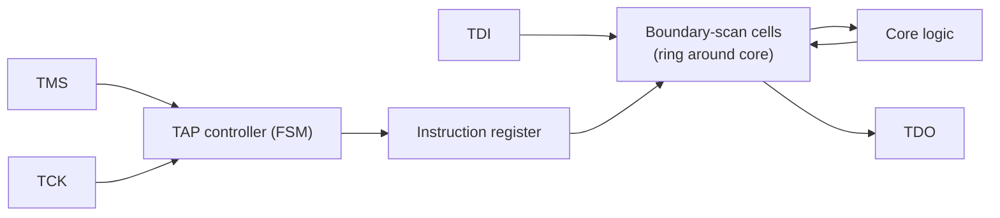
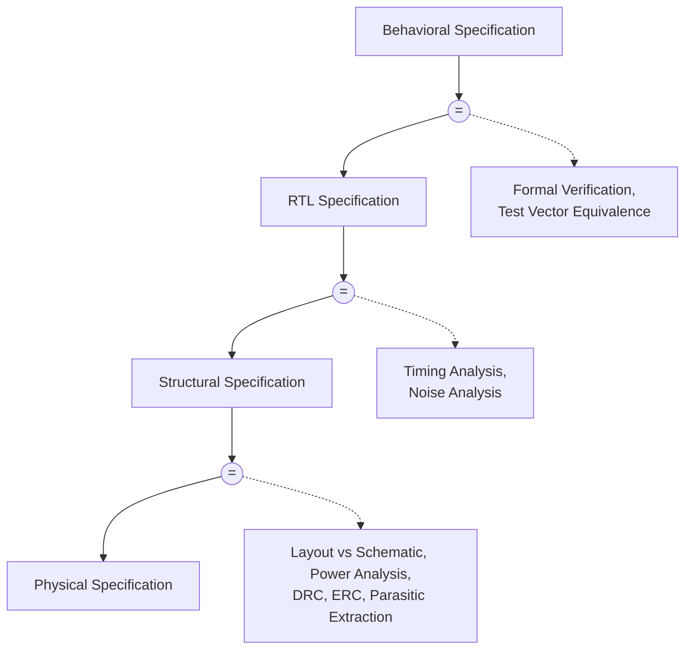
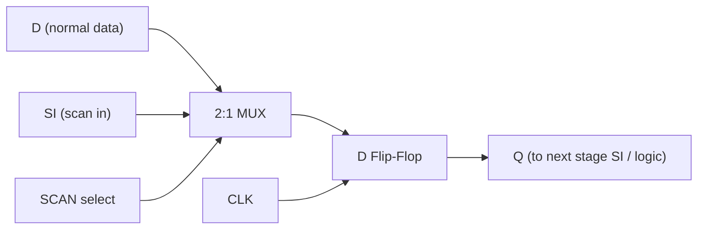
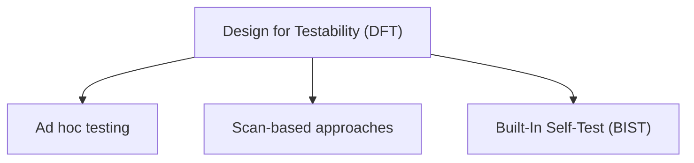
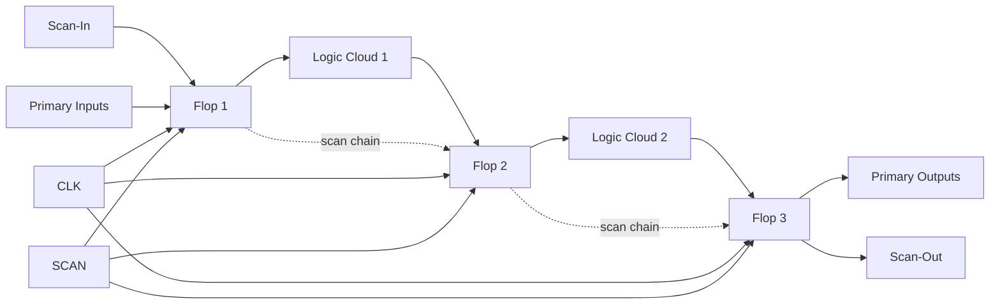
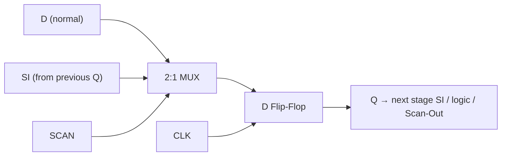

# Module-5 — Focused Exam Answers

> Source: answers are based primarily on `Module5_Part1.md` and `Module5_Part2.md`.
> Where information is not in the notes but is needed for correctness, it is marked **(beyond notes)**.
> Transistor schematics and stick diagrams cannot be drawn meaningfully in Markdown, so they are marked with an **[INSERT DIAGRAM: ...]** placeholder. Block/architecture/flow diagrams are drawn with Mermaid.
> Notation: variables in the text use inline LaTeX (e.g. $V_{DD}$, $C_S$, $\overline{BL}$); Mermaid labels use plain text/Unicode because Mermaid does not render LaTeX.

---

## Q1. (a) Automatic Test Pattern Generation (ATPG)  (b) Boundary Scan architecture (10 marks)

### (a) Automatic Test Pattern Generation (ATPG)

- Historically logic/circuit designers built the function, mask designers did layout, and **test engineers wrote the tests** — effectively reverse-engineering circuits to devise adequate tests.
- As chip complexity grew, this manual approach became impractical, so **ATPG (Automatic Test Pattern Generation)** methods were invented to automatically generate the input test vectors.
- ATPG generates a set of test vectors that, when applied to the circuit, expose modeled faults (e.g. **stuck-at-0 / stuck-at-1**) by making a faulty circuit produce an output different from the **known good machine**.
- Its effectiveness is measured by **fault coverage** (percentage of nodes whose faults are detected); world-class quality needs **> 98.5%** fault coverage.
- ATPG works best on **combinational blocks**, which is why it is paired with **scan design** — scan turns sequential logic into combinational blocks bounded by scan registers, and the scan chain itself is easily tested with a random 1/0 pattern. The use of some form of ATPG is now standard for most digital design.

### (b) Boundary Scan architecture — **(beyond notes)**

> Honest note: Boundary Scan is listed in the syllabus (Text 2: 15.7) but is **not** present in `Module5_Part1.md`/`Module5_Part2.md`. The following is standard IEEE 1149.1 (JTAG) material from my own knowledge — please cross-check with your textbook.

- Boundary scan was created to test **board-level interconnects** (solder joints between chips) without bed-of-nails probes, by placing a **boundary-scan cell** (a scan flip-flop + mux) on every primary I/O pin of the chip.
- These cells are chained into a **boundary-scan register** around the periphery of the core logic. Test data is shifted in serially, driven onto the pins/board, captured, and shifted out for comparison.
- Control is via the **TAP (Test Access Port)** — four (optionally five) dedicated pins: **TCK** (test clock), **TMS** (test mode select), **TDI** (test data in), **TDO** (test data out), and optional **TRST** (reset).
- The **TAP controller** is a 16-state FSM driven by TMS that sequences the operations; an **instruction register** selects which data register (boundary-scan, BYPASS, or IDCODE) connects between TDI and TDO.

**Key reasoning (step-by-step):**
1. Manual test writing did not scale → ATPG automates test-vector generation.
2. ATPG targets modeled faults and is scored by fault coverage (>98.5%).
3. ATPG needs combinational blocks → combined with scan.
4. Boundary scan (beyond notes) adds scan cells on I/O pins to test board interconnects.
5. A TAP controller + TDI/TDO/TMS/TCK shifts and applies the boundary data.

---

## Q2. Functional equivalence at various levels of abstraction in logical verification (10 marks)

- **Logic verification** checks that the chip performs its intended function; these functionality tests are run **before tapeout**.
- The design exists at several **levels of abstraction**, from a high-level behavioural/specification description down to the physical layout. The behavioural specification may be a verbal/textual description, a C or SystemC model, an HDL (VHDL/Verilog) description, or simply a table of inputs and required outputs.
- **Functional equivalence** means running a **simulator** on two descriptions of the chip (e.g. one at gate level and one at functional level) and confirming the **outputs match at convenient checkpoints in time for all applied inputs**.
- This is done conveniently in an HDL using a **test bench** — a wrapper around a module that provides stimulus and automatically checks the responses.
- Equivalence is checked **at each level of the design hierarchy**; small tests are written to verify equivalence between adjacent levels, so confidence is built level by level.

The hierarchy and the checks applied between adjacent levels (Figure 1 of notes):

- Behavioral ↔ RTL: checked by **formal verification / test-vector equivalence**.
- RTL ↔ Structural: checked by **timing analysis and noise analysis**.
- Structural ↔ Physical: checked by **LVS, power analysis, DRC, ERC, parasitic extraction**.

**Key reasoning (step-by-step):**
1. A design is described at multiple abstraction levels.
2. Functional equivalence = simulate two levels, compare outputs for all inputs.
3. A test bench supplies stimulus and auto-checks results.
4. Equivalence is verified between each pair of adjacent levels.
5. Different check types apply at each boundary (formal, timing/noise, LVS/DRC/ERC).

---

## Q3. Principles of logical verification + scannable flip-flop in scannable register design (10 marks)

### Principles of logical verification

- Verification tests are usually the **first** tests a designer builds, as part of the design process, and are run **before tapeout** to confirm the chip does its intended function.
- **RTL** is treated as equivalent to the design specification at a higher behavioural level; the specification can be verbal, textual, a C/SystemC model, an HDL description, or an input/output table.
- The core principle is **functional equivalence**: simulate two descriptions (e.g. functional vs gate level) and ensure outputs are equivalent at checkpoints for all inputs, conveniently using a **test bench** for stimulus + automatic checking.
- Verification is performed **at each level of the design hierarchy**, writing small tests to verify equivalence between levels.

### Scannable flip-flop (scan register)

- A **scan register** is a **D flip-flop preceded by a multiplexer** controlled by a `SCAN` signal:
  - `SCAN` **deasserted** → register behaves normally, storing the `D` input.
  - `SCAN` **asserted** → data is loaded from the `SI` (scan-in) pin, which connects in shift-register fashion to the previous register's `Q` in the **scan chain**.
- This gives **observability and controllability** at every register: N clock pulses in scan mode shift all N state bits out (observe) and shift N new bits in (control).
- The prime cost is the **area and delay of the extra multiplexer**, considered well worth the debug/test savings.

**Key reasoning (step-by-step):**
1. Verification confirms intended function before tapeout.
2. Principle = functional equivalence between abstraction levels via simulation + test bench.
3. A scan register = D-FF + input mux selecting D or SI.
4. SCAN low → normal; SCAN high → shift along scan chain.
5. This yields full controllability/observability at every register (cost: the mux).

---

## Q4. CMOS pseudo-static D flip-flop using transmission gates + working (10 marks)

- A D flip-flop can be formed from a JK flip-flop ($J = D$, $K = \overline{D}$), but a **much simpler version** is obtained with a **pseudo-static** approach using transmission gates.
- **Components (from notes):** two **transmission gates** (TGs) acting as pass switches for the master and slave stages, and three **inverters** — one input inverter and two that form the output buffer / feedback loop. Clocks used are $\phi$ and its complement $\overline{\phi}$.

**Working:**
- **Sample phase ($\phi = 1$):** the first (master) transmission gate, clocked by $\phi$, is ON and passes the `D` input into the first inverter, so the master latch follows `D`.
- **Hold/latch phase ($\phi = 0$, $\overline{\phi} = 1$):** the master TG turns OFF and the second (slave) TG, clocked by $\overline{\phi}$, turns ON, closing the **inverter feedback loop** that latches and holds the value, presenting it at $Q$ (and $\overline{Q}$).
- It is called **"pseudo-static"** because the feedback inverter loop continually **refreshes** the stored level, so unlike a purely dynamic (charge-storage) latch the data is not lost if the clock is stopped for a long time — it retains state statically while power is applied.

**[INSERT DIAGRAM: CMOS pseudo-static D flip-flop schematic — input inverter, master TG clocked by $\phi$, slave TG clocked by $\overline{\phi}$, and two inverters forming the output buffer + feedback latch producing $Q$ and $\overline{Q}$.]** *(Transmission-gate transistor schematic — not suitable for Mermaid.)*

> Honest note: the notes give the component list and identify it as a master–slave / pseudo-static TG structure but are light on the detailed clock-by-clock waveform; the phase-by-phase working above is the standard interpretation **(partly beyond notes)**.

**Key reasoning (step-by-step):**
1. Pseudo-static D-FF is the simple TG alternative to the JK-based D-FF.
2. Build it from 2 transmission gates + 3 inverters.
3. $\phi=1$: master TG passes D in.
4. $\phi=0$: slave TG closes the inverter feedback loop to latch/hold.
5. Feedback refreshes the node → static retention ("pseudo-static").

---

## Q5. Principles of logical verification in detail (10 marks)

- **Purpose:** logic verification (functionality testing) verifies the chip performs its intended function; it is run **before tapeout** and is usually the first set of tests a designer constructs.
- **Specification levels:** the behavioural specification against which the design is checked can be a verbal description, a plain-language text spec, a high-level language model (C), a system-modelling language (SystemC), an HDL (VHDL/Verilog), or simply a **table of inputs and required outputs**. **RTL** is taken as equivalent to the specification at a higher behavioural level.
- **Functional equivalence (core principle):** run a **simulator** on two descriptions of the chip (e.g. gate-level vs functional-level) and ensure outputs are **equivalent at convenient checkpoints in time, for all inputs applied**.
- **Test bench:** in an HDL this is done with a test bench — a wrapper that surrounds a module, applies **stimulus**, and performs **automated checking** of the responses.
- **Hierarchical checking:** equivalence is checked **at various levels of the design hierarchy** (behavioural ↔ RTL ↔ structural ↔ physical). At an RTL description, system-level behaviour may be fully verified; small tests are written at each level to verify equivalence. Associated checks include formal verification/test-vector equivalence, timing and noise analysis, and (toward layout) LVS, DRC, ERC, power and parasitic extraction.

**Key reasoning (step-by-step):**
1. Verification = confirm intended function, before tapeout.
2. A reference specification exists (text / C / HDL / I-O table).
3. Equivalence is judged by comparing simulated outputs for all inputs.
4. A test bench automates stimulus + checking.
5. Equivalence is verified level-by-level down the hierarchy.

---

## Q6. System timing considerations in synchronous digital systems (10 marks)

Based on a **two-phase non-overlapping clock** used throughout the system:

1. A **two-phase non-overlapping clock** is assumed available and is the only clock used throughout the system.
2. The phases are $\phi_1$ and $\phi_2$, where **$\phi_1$ leads $\phi_2$**.
3. Data is **written** to registers/storage/subsystems on $\phi_1$ — i.e. write signals $WR$ are **ANDed with $\phi_1$**.
4. Data written into storage is assumed to have **settled before the following $\phi_2$**, and $\phi_2$ may be used to **refresh** stored data where appropriate.
5. Delays through data paths and combinational logic are assumed **less than the interval** between the leading edge of $\phi_1$ and the leading edge of the following $\phi_2$.
6. Data is **read** from storage on the next $\phi_1$ — read signals $RD$ are **ANDed with $\phi_1$**; $RD$ and $WR$ are generally **mutually exclusive** for any one storage element.
7. For system stability, there must be **at least one clocked storage element in series with every closed-loop signal path**.

**Key reasoning (step-by-step):**
1. Assume one global two-phase non-overlapping clock ($\phi_1$ leads $\phi_2$).
2. Write on $\phi_1$ ($WR \cdot \phi_1$); allow data to settle by $\phi_2$; refresh on $\phi_2$.
3. Keep all logic/path delays shorter than the $\phi_1$→$\phi_2$ interval.
4. Read on $\phi_1$ ($RD \cdot \phi_1$); read and write are mutually exclusive per element.
5. Put ≥1 clocked element in every feedback loop for stability.

---

## Q7. Compare SRAM and DRAM + explain 1T DRAM in detail (10 marks)

*(This question explicitly asks for a comparison, so the table below is the answer itself.)*

| DRAM | SRAM |
|---|---|
| Stores data using **capacitors** | Stores data using **flip-flops / transistors** |
| Large storage capacity, **high density** | Less capacity, **low density** |
| Used in **main memory** | Used in **cache memory** |
| **Cheaper** | More **expensive** |
| Lower power consumption per bit | Higher power consumption |
| **Simple** structure (1 transistor + capacitor/bit) | **Complex** structure (typically 6 transistors/bit) |
| **Needs periodic refresh** (charge leaks) | **No refresh** needed |
| **Slower** | **Faster** |

**1T DRAM in detail:**
- A 1T DRAM cell is **one storage capacitor $C_S$** plus **one nMOS pass (access) transistor**.
- **Word line (WL)** drives the nMOS gate; **bit line (BL)** connects to the nMOS drain. WL must be HIGH for read/write. Data is supplied via the precharged bit line.
- **Write (BL = input line):** assert $WL = 1$; if $BL = 1$ then $C_S$ charges to $V_{DD}$, if $BL = 0$ then $C_S$ discharges to 0.
- **Read (BL = output line):** precharge $BL$ to $V_{DD}/2$, then assert $WL = 1$ (transistor ON). Charge sharing between $C_S$ and the bit-line capacitance $C_L$ shifts $BL$: if $C_S$ held a 1, $BL$ rises **above $V_{DD}/2$** → sense amp outputs 1; if $C_S$ held a 0, $BL$ falls **below $V_{DD}/2$** → sense amp outputs 0. The read is destructive, so the cell is **refreshed** afterwards.

**[INSERT DIAGRAM: 1T DRAM cell schematic — one nMOS with gate on WL, drain on BL, source on storage capacitor $C_S$ to ground.]**

**Key reasoning (step-by-step):**
1. DRAM = capacitor storage (dense, cheap, needs refresh); SRAM = latch storage (fast, complex, no refresh).
2. 1T cell = 1 capacitor $C_S$ + 1 nMOS, gated by WL, connected to BL.
3. Write: WL=1, BL drives $C_S$ to $V_{DD}$ or 0.
4. Read: precharge BL to $V_{DD}/2$, WL=1, sense whether BL goes above/below $V_{DD}/2$.
5. Read is destructive → refresh after.

---

## Q8. 1T DRAM cell with stick diagram + read/write (10 marks)

- **Structure:** one **nMOS access transistor** + one **storage capacitor $C_S$**. Gate → **WL**, drain → **BL**, source → $C_S$ (to ground). WL must be HIGH for any access.
- **Write operation (BL = input):**
  1. $BL = $ input value.
  2. $WL = 1$ (transistor ON).
  3. If $BL = 1$ → $C_S$ charges to $V_{DD}$; if $BL = 0$ → $C_S$ discharges to 0.
- **Read operation (BL = output):**
  1. Precharge $C_L$ (bit line) to $V_{DD}/2$.
  2. $WL = 1$ → transistor ON.
  3. If $C_S$ held charge (≈1 V/logic 1): $BL$ rises so $V > V_{DD}/2$ → sense amp gives **O/P = 1**; if $V < V_{DD}/2$ → **O/P = 0**.
  4. **Refresh** the cell (read is destructive).

**[INSERT DIAGRAM (schematic): 1T DRAM — nMOS gate=WL, drain=BL, source=$C_S$→GND.]**

**[INSERT DIAGRAM (stick): 1T DRAM cell — horizontal poly WL crossing an n-diffusion strip (the access transistor), metal BL contacting one diffusion end, the other diffusion end contacting the capacitor plate; substrate ground for $C_S$.]**

> Honest note: the notes describe the 1T cell and its read/write but do **not** include an actual stick diagram, so the stick layout above is described from standard layout conventions **(beyond notes)**.

**Key reasoning (step-by-step):**
1. Cell = 1 nMOS + capacitor $C_S$; WL gates access, BL carries data.
2. Write: WL=1, BL charges/discharges $C_S$.
3. Read: precharge BL to $V_{DD}/2$, WL=1, charge-share, sense vs $V_{DD}/2$.
4. Output 1 if BL ends above $V_{DD}/2$, else 0.
5. Refresh after read (destructive).

---

## Q9. 3T DRAM cell with stick diagram + read/write (10 marks)

- **Structure:** three nMOS transistors — **M1** = write access (gated by **WL**, write line), **M3** = read access (gated by **RL**, read line), **M2** = read evaluation transistor whose gate node **X** holds the stored charge on $C_S$. **Separate read/write lines** are used. $BL$ and $\overline{BL}$ are precharged via capacitors $C_1$/$C_2$.
- **Write operation:**
  1. $WL = 1$, $RL = 0$ → $M1 = ON$, $M2 = M3 = OFF$.
  2. $\overline{BL}$ = input line; node $X = V_{DD} - V_{tn}$ if $\overline{BL}=1$, or $X = 0$ if $\overline{BL}=0$ (charge stored on $C_S$).
  3. Then $WL = 0$ to isolate/hold.
- **Read operation:**
  1. $RL = 1$, $WL = 0$ → $M3 = ON$, $M1 = OFF$; $C_2$ precharged.
  2. If $X = V_{DD}-V_{tn}$ (stored 1) → $M2 = ON$ → discharge path pulls $\overline{BL} \to 0$; sense amp gives **BL = 1, O/P = 1**.
  3. If $X = 0$ (stored 0) → $M2 = OFF$ → $\overline{BL}$ stays high; sense amp gives **O/P = 0**.
- Note: read is **non-inverting at the cell output through the sense logic** as described, and storage is dynamic (needs refresh).

**[INSERT DIAGRAM (schematic): 3T DRAM — M1 (gate WL, fed by $\overline{BL}$) charging node X = gate of M2; M2 in series with M3 (gate RL) to the read bit line BL.]**

**[INSERT DIAGRAM (stick): 3T DRAM cell — two poly control lines (WL, RL) crossing n-diffusion for M1 and M3, the storage node X (gate of M2) formed by poly over diffusion, metal $\overline{BL}$ (write) and BL (read) lines.]**

> Honest note: notes describe the 3T cell and its read/write but contain **no stick diagram**; the stick description above is from standard conventions **(beyond notes)**.

**Key reasoning (step-by-step):**
1. 3T cell separates write (M1/WL) and read (M3/RL) paths; M2 senses stored charge.
2. Write: WL=1, RL=0; $\overline{BL}$ sets node X (gate of M2).
3. Hold by taking WL=0 (charge trapped on $C_S$ at X).
4. Read: RL=1, WL=0; if X=1, M2 conducts and discharges $\overline{BL}$ → O/P=1.
5. If X=0, M2 off, $\overline{BL}$ stays high → O/P=0; dynamic, needs refresh.

---

## Q10. 4T DRAM cell + read/write (10 marks)

- **Structure:** a **cross-coupled pair T1, T2** (NMOS, no static pull-ups) storing a differential state on their **gate capacitances $C_{g1}$, $C_{g2}$**, plus two pass transistors **T3, T4** gated by a single **WL**. Complementary bit lines **BL** and **$\overline{BL}$**. It is a **dynamic latch** (relies on gate capacitance → needs refresh).
- **Write operation:**
  1. Precharge $BL$ and $\overline{BL}$ to logic 1 first; the data is defined by which line is driven ($BL > \overline{BL} \Rightarrow$ 1, $BL < \overline{BL} \Rightarrow$ 0).
  2. $WL = 1$ → T3, T4 ON.
  3. The values on $BL$/$\overline{BL}$ are written through T3/T4 and stored as $C_{g1}$/$C_{g2}$ on T2/T1; the cross-coupling guarantees **complementary** stored states.
- **Read operation:**
  1. Precharge $BL$ and $\overline{BL}$ to logic 1 ($V_{DD}$).
  2. Suppose logic 1 is stored (gate of T2 = 1) → **T2 ON, T1 OFF**.
  3. With T3 ON, T4 ON and T2 ON, the precharged $\overline{BL}$ now has a **discharge path to ground** → $\overline{BL} = 0$, $BL = 1$.
  4. The **sense amplifier** detects this difference → reads $BL = 1$, $\overline{BL} = 0$ (the stored data).

**[INSERT DIAGRAM (schematic): 4T DRAM — cross-coupled T1/T2 (gate caps $C_{g1}$, $C_{g2}$), access transistors T3/T4 on WL connecting nodes to BL and $\overline{BL}$.]**

**Key reasoning (step-by-step):**
1. 4T cell = cross-coupled T1/T2 storing on gate caps + access T3/T4 on WL.
2. Bit lines BL/$\overline{BL}$ are precharged; data = which line is higher.
3. Write: WL=1, force complementary values onto the gate caps.
4. Read: precharge both lines high; the ON side provides a discharge path.
5. Sense amp resolves the BL/$\overline{BL}$ difference; dynamic → refresh needed.

---

## Q11. 6T SRAM cell + read/write (10 marks)

- **Structure:** **two cross-coupled CMOS inverters** (T1/T2 form one, T3/T4 form the other) holding complementary nodes **$Q$ and $\overline{Q}$**, accessed by **two nMOS pass transistors T5, T6** gated by a single **WL**, connecting to complementary bit lines **$\overline{BL}$ and $BL$**. It is **fully static** — holds state indefinitely while powered.
- **Modes:** Hold, Read, Write.
- **Hold ($WL = 0$):** T5, T6 OFF → the cross-coupled latch retains its data (0 or 1).
- **Read (non-destructive):**
  1. Store e.g. $Q = 1$, $\overline{Q} = 0$.
  2. Precharge $BL$ and $\overline{BL}$ to an intermediate voltage ($V_{DD}/2$).
  3. $WL = 1$ → T5, T6 ON. The side at 0 ($\overline{Q}$) provides a discharge path: precharged $\overline{BL}$ discharges through T5 and the ON pull-down to ground, so $\overline{BL}$ falls while $BL$ stays high.
  4. The **sense amplifier** compares: if $BL > \overline{BL}$ → output 1, if $BL < \overline{BL}$ → output 0.
- **Write (overpower the latch):**
  1. Drive the bit lines with the desired value (e.g. to write 1: $BL = 1$, $\overline{BL} = 0$), $WL = 1$ (T5, T6 ON).
  2. The strong write drivers **overcome the weak feedback** of the inverters: the 0 forced on the appropriate line discharges the high internal node below $V_{th}$, flipping the cross-coupled inverters to the new state.
  3. The latch then holds the new value ($Q$ flips 0→1 in the example).

**[INSERT DIAGRAM (schematic): 6T SRAM — two cross-coupled inverters (T1/T2 and T3/T4) with nodes $Q$/$\overline{Q}$, access transistors T5/T6 on WL to $\overline{BL}$/$BL$.]**

**Key reasoning (step-by-step):**
1. 6T = two cross-coupled inverters (latch) + 2 access transistors on WL.
2. Hold: WL=0, latch keeps data (static, no refresh).
3. Read: precharge BL/$\overline{BL}$ to $V_{DD}/2$, WL=1, the 0-side discharges its line.
4. Sense amp compares BL vs $\overline{BL}$ → output.
5. Write: drive bit lines strongly, overpower feedback, flip the latch.

---

## Q12. Pseudo-static RAM cell + read/write (10 marks)

> Honest note: `Module5_*` do **not** contain a dedicated "pseudo-static RAM cell" section — the only pseudo-static item in the notes is the **pseudo-static D flip-flop** (Q4), and system-timing point 4 ("$\phi_2$ may be used to refresh stored data"). The explanation below applies that same pseudo-static principle to a RAM cell and is **partly beyond notes**; please verify against your textbook.

- A **pseudo-static RAM cell** stores data **dynamically** (on a capacitance / dynamic node like a DRAM cell) but adds a **feedback / refresh path** so the data is **automatically refreshed** and held indefinitely while power is applied — giving DRAM-like simplicity with SRAM-like retention (the user does not have to issue external refresh).
- Practically, a dynamic cell (e.g. a 3T-style storage node, or an inverter pair) is augmented with a **feedback inverter loop enabled on the non-active clock phase**. Using the two-phase clock of the notes: data is **written on $\phi_1$**, and the stored level is **refreshed/recirculated on $\phi_2$** through the feedback path, continuously restoring the charge.
- **Write:** during $\phi_1$ (write enabled), the input drives the storage node to the new value through the access switch; the feedback loop is broken so the new value overwrites the old.
- **Read:** during the read phase the stored node value is buffered out (through an inverter/sense path) **non-destructively**, while the feedback/refresh keeps the node topped up so the value is not lost.
- Because the feedback continually refreshes the node, the cell behaves like a static cell to the outside world even though the underlying storage is dynamic — hence **"pseudo-static."**

**[INSERT DIAGRAM: pseudo-static RAM cell — dynamic storage node with an access/write transmission gate (enabled on $\phi_1$) and a feedback inverter loop closed on $\phi_2$ for refresh, plus an output buffer.]**

**Key reasoning (step-by-step):**
1. Pseudo-static = dynamic storage + automatic refresh feedback.
2. Write on $\phi_1$: input drives the storage node (feedback open).
3. On $\phi_2$: feedback loop recirculates/refreshes the stored value.
4. Read: buffer the node out non-destructively while refresh holds it.
5. Net effect: static-like retention with dynamic-cell simplicity.

---

## Q13. Fault models used in logic verification and testing (10 marks)

- **Stuck-At faults (most common):** a faulty gate input/node is modelled as permanently **Stuck-At-0 (S-A-0)** or **Stuck-At-1 (S-A-1)**. Originated from board-level testing; most frequently caused by **gate-oxide shorts** (nMOS gate to GND, pMOS gate to $V_{DD}$) or **metal-to-metal shorts**.
- **Short-circuit (bridging) faults:** two nodes unintentionally connected. A bridge may act like a stuck-at (e.g. short **S1** produces an S-A-0 at input A) or **modify the gate's logic function** (short **S2**). For accuracy, faults are best modelled at the **transistor level**, where the complete circuit structure is visible.
- **Open-circuit (stuck-open) faults:** a broken connection (e.g. an nMOS source open to GND). This can make a gate **sequential/state-dependent** — its output depends on the previous state, e.g. $Z = \sim(A|B) \,|\, (\sim B \,\&\, Z')$ for a NOR with an open.
- **Faults causing static $I_{DD}$:** a defect creating a DC path from $V_{DD}$ to GND draws quiescent current — the basis of **IDDQ testing**.
- **Delay faults:** the circuit is still **functionally correct but slow**. E.g. an open in one of several paralleled nMOS source connections still gives $Z = \sim A$ but with **increased $t_{pdf}$**; detection becomes state-dependent (sequential).

**Key reasoning (step-by-step):**
1. Stuck-at (S-A-0 / S-A-1) is the standard, simple model.
2. Bridging/short faults connect nodes → stuck-at or altered function.
3. Open faults break connections → can create state-dependent behaviour.
4. Some defects create static $I_{DD}$ paths → caught by IDDQ.
5. Delay faults keep function but break timing (increased $t_{pdf}$).

---

## Q14. Design for Testability (DFT) techniques in CMOS VLSI (10 marks)

- The keys to a testable circuit are **controllability** (ability to set every internal node to 1 and reset to 0) and **observability** (ability to observe, directly or indirectly, the state of any node).
- Good controllability/observability **reduce manufacturing test cost** (high fault coverage with few vectors) and are essential for **silicon debug**, since physically probing internal signals is very difficult.
- The three main DFT approaches:

- **Ad hoc testing:** a "bag of tricks" to reduce the combinational explosion of testing — partitioning large sequential circuits, adding **test points**, adding **multiplexers**, and providing **easy state reset**. Useful only for small designs.
- **Scan-based approaches:** registers double as a **scan chain** (D-FF + mux), giving observability/controllability at every register; works hand-in-hand with **ATPG**.
- **Built-In Self-Test (BIST):** on-chip pattern generation + signature analysis (PRSG → logic → signature analyzer), so the circuit tests itself.

**Key reasoning (step-by-step):**
1. Testability rests on controllability + observability.
2. Better controllability/observability → cheaper test, easier debug.
3. Three approaches: ad hoc, scan, BIST.
4. Ad hoc = test points/muxes/partition/reset for small designs.
5. Scan + ATPG and BIST are the systematic, scalable methods.

---

## Q15. Manufacturing test principles for the CMOS fabrication process (10 marks)

- **Purpose:** manufacturing test screens out **defective parts before shipment**. Because of process complexity (dust particles, mask imperfections), not all die work; **yield** = good die / total die per wafer. Typical commercial targets are **350–1000 defects per million (DPM)** shipped.
- **Test levels:** a die can be tested at **wafer, packaged-chip, board, system, and field** levels.
- **Fault models** (what we test for): **stuck-at (S-A-0/1)**, **bridging/short**, **open**, **delay**, and defects causing **static $I_{DD}$** (IDDQ). For accuracy, model at the **transistor level**.
- **Key metrics:**
  - **Observability** — how well an internal node can be seen at the output pins.
  - **Controllability** — how easily a node can be driven to 1 or 0.
  - **Repeatability** — same inputs give same outputs (combinational & synchronous logic is repeatable; some asynchronous circuits, e.g. arbiters, are not).
  - **Survivability** — ability to keep functioning after a fault (ECC, redundant rows/columns, spare cores).
  - **Fault coverage** — percentage of nodes whose S-A-0/S-A-1 faults are detected by the vectors, found by comparing a **faulty machine** against a **known good machine**. World-class quality needs **> 98.5%**.
- **ATPG** is used to generate the vectors automatically; scan makes this practical.

**Key reasoning (step-by-step):**
1. Goal: catch defective die before shipping (target 350–1000 DPM).
2. Test at wafer/chip/board/system/field levels; yield = good/total.
3. Use fault models (stuck-at, bridge, open, delay, IDDQ).
4. Judge tests by observability, controllability, repeatability, survivability, fault coverage.
5. Need >98.5% coverage; ATPG + scan generate/apply the vectors.

---

## Q16. Short notes: (a) Ad Hoc testing, (b) IDDQ testing (10 marks)

### (a) Ad Hoc testing
- Collections of ideas ("a bag of tricks") aimed at reducing the **combinational explosion** of testing.
- Useful **only for small designs** where scan, ATPG and BIST are not available (a full scan methodology is recommended for all digital circuits).
- Common techniques: **partitioning large sequential circuits**, **adding test points**, **adding multiplexers**, and **providing for easy state reset**.

### (b) IDDQ testing
- A method of testing for **bridging faults**, also called **supply current monitoring** (IDDQ = $V_{DD}$ supply current, Quiescent).
- Relies on the fact that a CMOS gate that is **not switching draws no DC current** except leakage; a **bridging fault** causes a measurable DC $I_{DD}$ for some input combination.
- Procedure: apply the normal vectors, let signals settle, then **measure $I_{DD}$**. It must be **very sensitive** (often only one gate is affected). Circuits that draw DC current (pseudo-nMOS, analog) must be **disabled**; dynamic gates cause problems too.
- Current measuring is **slow** (~1 ms/vector), increasing test time. Can be done **externally** ($V_{DD}$ line) or **internally** (test circuits). Gives **indirect massive observability at little overhead**, but becomes **ineffective as subthreshold leakage rises** (leakage variation swamps the fault current).

**Key reasoning (step-by-step):**
1. Ad hoc = informal tricks (test points, muxes, partition, reset) for small designs.
2. IDDQ detects bridging faults via quiescent supply current.
3. No-switching CMOS draws ~0 DC; a bridge creates measurable $I_{DD}$.
4. Apply vectors, settle, measure $I_{DD}$ (slow, very sensitive; disable DC-current circuits).
5. Cheap massive observability but fails when subthreshold leakage is large.

---

## Q17. Built-In Self-Test / Built-In Logic Block Observation (10 marks)

- Combining **signature analysis** with the **scan** technique creates **BIST (Built-In Self-Test)**, also called **BILBO (Built-In Logic Block Observation)** — the circuit generates its own test patterns and analyses its own responses.
- The building block is a **3-bit BIST register**: a **scannable, resettable** register that can also act as a **pattern generator** and a **signature analyzer**, with mode set by **C[1:0]**:

| MODE | C[1] | C[0] | Behaviour |
|---|---|---|---|
| Scan | 0 | 0 | 3-bit shift register SI→SO (inversion between stages) |
| Test | 0 | 1 | Pseudo-random sequence generator / signature analyzer |
| Reset | 1 | 0 | All flip-flops synchronously set to 0 |
| Normal | 1 | 1 | Normal D-in / Q-out operation |

- In **test mode**: if all D inputs are held low, the Q outputs cycle through a **pseudo-random bit sequence (PRSG)** that drives the logic; if the D inputs come from the logic outputs, they are combined ("swizzled") with the current state to form the **syndrome** (a **MISR / signature analyzer**, an LFSR topology).
- **System use:** **PRSG → Logic Cloud → Signature Analyzer.**

- **Procedure:** (1) **reset** the syndrome in the output register; (2) put both registers in **test mode** to generate pseudo-random inputs and compute the syndrome; (3) **shift the syndrome out** through the scan chain and compare to the expected signature.

**Key reasoning (step-by-step):**
1. BIST/BILBO = signature analysis + scan, on-chip self-testing.
2. A BIST register is scannable + resettable + can be PRSG/signature analyzer.
3. C[1:0] selects scan/test/reset/normal modes.
4. Flow: PRSG generates patterns → logic → signature analyzer compacts responses.
5. Reset syndrome, run test mode, shift syndrome out, compare.

---

## Q18. Scan chain implementation + advantages, with sketch (10 marks)

- **Implementation:** every register is built as a **scan register** = a **D flip-flop preceded by a 2:1 multiplexer** selected by a **SCAN** signal:
  - **SCAN deasserted (normal mode):** the FF stores its normal **D** input — the circuit runs as usual through its logic clouds.
  - **SCAN asserted (scan mode):** the FF loads from **SI**, which is wired to the **previous FF's Q**, so all FFs form one long **shift register (scan chain)** from **Scan-In** to **Scan-Out**.
- **Test procedure (example, two ranks of 4-bit registers):**
  1. Assert SCAN, pulse CLK 8 times → shift a test vector into the registers.
  2. Deassert SCAN, pulse CLK **one** cycle → the logic clouds operate normally on the loaded inputs and the results are captured.
  3. Reassert SCAN, pulse CLK 8 times → shift the captured results out (and shift in the next vector simultaneously).

- **Advantages:**
  - **Controllability and observability at every register** — any logic-cloud input can be set and any output observed.
  - **Highly automatable test generation** — **ATPG** handles the combinational blocks; the chain itself is tested by shifting a random 1/0 pattern.
  - Big savings in **debug time and production test cost**.
- **Prime disadvantage:** the **area and delay overhead** of the extra multiplexer in every register (widely accepted as worth it).

**Key reasoning (step-by-step):**
1. Replace each FF with (mux + D-FF) controlled by SCAN.
2. SCAN low = normal; SCAN high = one big shift register (scan chain).
3. Shift vector in → run 1 normal clock → shift results out.
4. Gives full controllability/observability + easy ATPG.
5. Cost: extra mux area/delay, accepted for the test savings.

---

## Q19. Ways to optimise a circuit for manufacturability to increase yield (10 marks)

1. **Physical (mask-level):** reduce the effect of process defects using layout guidelines —
   - **Increase spacing between wires** → fewer defect-induced shorts.
   - **Increase overlap of layers around contacts/vias** → tolerates misalignment.
   - **Use more than one via** at wire intersections → fewer defect-induced opens.
   (Design tools increasingly do this automatically.)
2. **Redundancy:** add **redundant structures** to tolerate defects — e.g. memory arrays with **spare rows**; if a word is defective, reconfigure to the spare using **laser-cut wires or programmable fuses**. Defective banks/cores can be disabled (even in software).
3. **Power:** keep power in check — elevated power causes excess wire current and **metal-migration failures**, and raises die temperature (degrading performance and causing parameter shifts over time).
4. **Process spread:** simulate at different **process corners**; use **Monte Carlo analysis** to model spread and **centre the design** within process variations.
5. **Yield analysis:** send failing dice to a lab to find the **root cause**; redesign layout of structures causing many failures (e.g. the Pentium case — silicide over long thin poly cracked, raising resistance; poly was widened/strapped with metal to boost high-frequency yield).

**Key reasoning (step-by-step):**
1. Physical: spacing, contact/via overlap, multiple vias → fewer shorts/opens.
2. Redundancy: spare rows/banks reconfigured via fuses/laser.
3. Power: limit current/temperature to avoid electromigration & parameter shift.
4. Process spread: corners + Monte Carlo, centre the design.
5. Yield analysis: root-cause failing dice and redesign weak structures.

---

## Q20. Scannable flip-flop in scannable register design (10 marks)

- A **scannable flip-flop (scan register)** is a **D flip-flop preceded by a 2:1 multiplexer** controlled by a **SCAN** signal — this is the fundamental cell of scan-based DFT.
  - **SCAN deasserted:** behaves as a **conventional register**, storing the **D** input (normal operation).
  - **SCAN asserted:** loads from the **SI** pin, connected shift-register-fashion to the previous register's **Q**, so all such FFs link into a **scan chain** from Scan-In to Scan-Out.
- **Why (design intent):** it provides **observability and controllability at every register** — by clocking N times in scan mode, all N state bits shift out (observe) while N new bits shift in (control). A random 1/0 pattern through the chain also tests the chain itself, and **ATPG** can target the combinational blocks between registers.
- **Cost:** the **area and delay of the extra multiplexer** in each register — universally regarded as outweighed by the debug and production-test savings.

**Key reasoning (step-by-step):**
1. Scannable FF = D-FF + input mux selected by SCAN.
2. SCAN low → normal D storage; SCAN high → load from SI (chain).
3. Chaining all FFs forms a scan chain (Scan-In → Scan-Out).
4. Gives controllability/observability at every register + self-testable chain.
5. Cost is the extra mux (area/delay), accepted for the test benefit.
